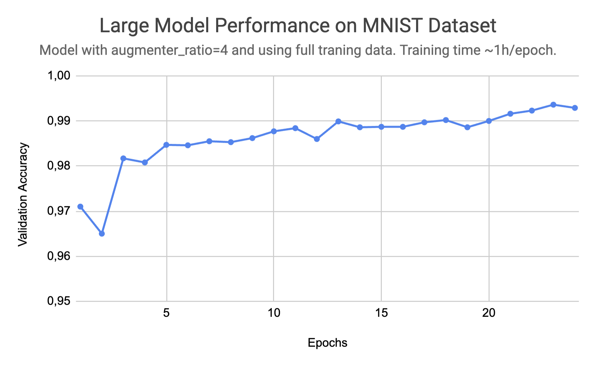
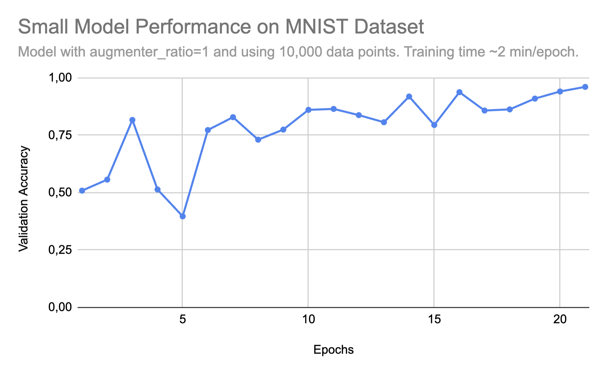

# CV_Models
## Full implementation of most used Computer Vision layers in plain code (numpy)

### Inspiration
- This idea started as a personal project after reading <i>Neural Networks and Deep Learning</i> by Michael Nielsen.
- The OOP-based approach was built after watching CS231n on youtube, and that is the current implementation.

### Requirements
- The only packaged used for the model is numpy. Other libraries are listed on requirements.txt.
- Note: scipy is used for faster implementation of Correlation and Convolution. I also made fully numpy-based implementations. They work and are in the functions.py file. The scipy implementation is only being used due to efficiency gains in training.
- To setup a miniconda virtual environment, run on terminal:
```
conda create -n environment_name python=3.8
```
- The requirements can be installed on a virtual environment with the command
```
pip install -r requirements.txt
```
- Note: The training is only implemented on CPU (no torch, tensorflow or CUDA support).
- To run, install the necessary requirements and a image dataset (.csv format).
- There must be a training and a test files. The files must have the label as the first column, and the features as the remaining columns.
- You can download your image file in the data directory.
  
### Training
- To train a CNN on your image dataset, go into run.sh and set the flag to --train and choose the following arguments:
  - --train_data (full path to your training data file, default path to mnist)
  - --test_data (full path to your test data file) 
  - --epochs (number of full passes through training data @ traintime) <b>[OPTIONAL, default=30]</b>
  - --batch_size (size of the batch (number of images per batch)) <b>[OPTIONAL, default=15]</b>
  - --augmenter_ratio (1 or 4, 1:ratio is how many times training dataset will be augmented) <b>[OPTIONAL, default=1]</b>
  - --to_path (path to .json file where model parameters will be stored for later use) <b>[OPTIONAL]</b>
```
python3 run.py --train --train_data=path_to_train_data --test_data=path_to_test_data --to_path=name_of_json_that_will_store_model.json
```
- Run on terminal:
```
./run.sh
```
- Whenever you feel like the validation accuracy (%) is good enough, you can kill the training at any time. This will NOT corrupt the model saved .json file, and you may proceed to testing and using the model :).
- Note: if you want to alter layers/dimensions, do so in the run.py file, with the .add(Layer) method.

### Testing
- To test a CNN on your image dataset, go into run.sh and set the flag to --test and choose the following arguments:
  - --test_data (full path to your test data file) 
  - --from_path (path to file with model parameters to be loaded)
```
python3 run.py --test --test_data=path_to_test_data --from_path=name_of_json_with_model.json
```
- Run on terminal:
```
./run.sh
```
- Note: the accuracy score for these tests will usually be lower than the accuracy scores achieved with the training and validation sets.

### Results
- The full Convolutional Neural Network implementation achieved <b>99.36%</b> accuracy on the validation set of the MNIST handwritten digit dataset.
- This implementation is NOT the one presented in the run.py file.
- The 99.36% implementation used 5 kernels, and 256-dimensioned Dense layers.
- The training time was ~20h on my M2 CPU.
  
<p align="left", style="margin-left:35px;">
  
</p>
- With the implementation present in run.py, I achieved <b>96,1%</b> in ~1h of training (M2 CPU) on the MNIST dataset.

<p align="left", style="margin-left:35px;">
  
</p>
- Thank you for reading!

