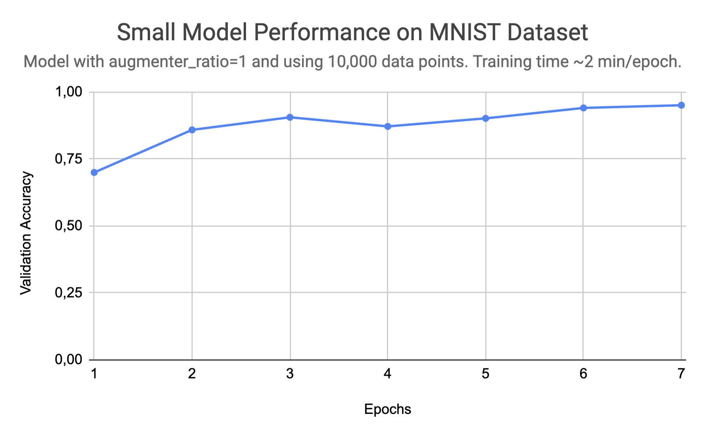

# CNN From Scratch in Vanilla Python
- Use this repo to __train and test your own CNN__. Feel free to browse the classes in [layers.py](layers.py). They contain a full CNN implementation in __less than 50 lines of code__.
- This idea started as a personal project after reading <i>Neural Networks and Deep Learning</i> by Michael Nielsen.
- The OOP-based approach was built after watching CS231n on youtube, and that is the current implementation.

## 1. Project Structure

- `data/` : Folder to store training and testing datasets. Currently holds MNIST dataset, which is the default.

- `models/` : Folder which stores the saved models. Further explaination in section 2.

- `layers.py` : File containing every layer of the CNN. Each layer is a class with a `.forward` and `.backward` method.

- `model.py` : File with the `Model` class.
  
- `run.py` : Script ran by the `./run.sh` command. Trains the model.
  
- `run.sh` : Bash script to be executed by the user.
  
- `utils.py` : File with helper functions and classes.

## 2. Running it Yourself
<details>
<summary> <h3>Requirements</h3> </summary>

- The only packaged used for the model is numpy. Other libraries are listed on `requirements.txt`.
- To setup and join a miniconda virtual environment, run on terminal:
```
conda create -n environment_name python=3.8
conda activate environment_name
```
> **Note:** Scipy is used for faster implementation of Correlation and Convolution. I also made fully numpy-based implementations. They work and are in the `functions.py` file. The scipy implementation is only being used due to efficiency gains in training.
- The requirements can be installed on a virtual environment with the command
```
pip install -r requirements.txt
```
- To run, install the necessary requirements and a image dataset (.csv format).
- There must be a training and a test files. The files must have the label as the first column, and the features as the remaining columns.
- You can download your image file in the data directory.
> **Note:** The training is only implemented on CPU (no torch, tensorflow or CUDA support).

</details>

<details>
<summary> <h3>Training</h3> </summary>
  
- To train a CNN on your image dataset, go into run.sh and set the flag to `--train` and choose the following arguments:
  - `--train_data` (full path to your training data file)                                      <b>[OPTIONAL]</b>
  - `--test_data` (full path to your test data file)                                           <b>[OPTIONAL]</b>
  - `--epochs` (number of full passes through training data @ traintime)                       <b>[OPTIONAL]</b>
  - `--batch_size` (size of the batch (number of images per batch))                            <b>[OPTIONAL]</b>
  - `--augmenter_ratio` (1 or 4, 1:ratio is how many times training dataset will be augmented) <b>[OPTIONAL]</b>
  - `--to_path` (path to .json file where model parameters will be stored for later use)       <b>[OPTIONAL]</b>
```
python3 run.py --train --train_data=path_to_train_data --test_data=path_to_test_data --to_path=name_of_json_that_will_store_model.json
```
- Run on terminal:
```
./run.sh
```
- Whenever you feel like the validation accuracy printed is good enough, you can kill the training at any time. This will NOT corrupt the model saved in the given .json file, and you may proceed to testing and using the model :).
> **Note:** If you want to alter layers/dimensions, do so in the `run.py` file, with the `.add(Layer)` method.

</details>

<details>
<summary> <h3>Testing</h3> </summary>

  - To test a CNN on your image dataset, go into run.sh and set the flag to `--test` and choose the following arguments:
  - `--test_data` (full path to your test data file) 
  - `--from_path` (path to file with model parameters to be loaded)
```
python3 run.py --test --test_data=path_to_test_data --from_path=name_of_json_with_model.json
```
- Run on terminal:
```
./run.sh
```
> **Note:** The accuracy score for these tests will usually be lower than the accuracy scores achieved with the training and validation sets.

</details>

## 3. Results
- The full Convolutional Neural Network implementation achieved <b>99.36%</b> accuracy on the validation set of the MNIST handwritten digit dataset.
- This implementation is NOT the one presented in the `run.py` file.
- The <b>99.36%</b> implementation used 5 kernels, and 256-dimensioned Dense layers.
- The training time was ~25h on my M2 CPU.
  
<p align="left", style="margin-left:35px;">
  
</p>
- With the implementation present in run.py, I achieved <b>96,1%</b> in ~15min of training (M2 CPU) on the MNIST dataset.

<p align="left", style="margin-left:35px;">
  
</p>
- Thank you for reading!

